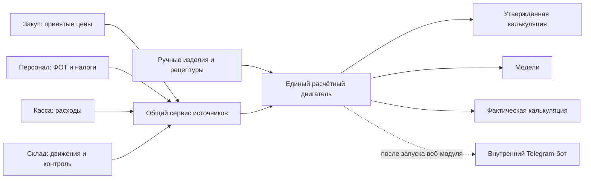

# Техническое задание: плитка «Калькуляция себестоимости»

> Проект: NVGRN Hub / Novagreen Foods<br>
> Формат документа: постановка задачи для Claude, Codex или другого разработчика<br>
> Версия ТЗ: 1.1<br>
> Дата: 9 августа 2026 года<br>
> Статус: обновлено по обратной связи Шоха; дополнение 1.1 в конце документа имеет приоритет

---

## 1. Задача одним абзацем

Нужно собрать в NVGRN Hub удобную плитку «Калькуляция себестоимости», в которой Шох и финансовый сотрудник смогут видеть утверждённую себестоимость каждого изделия, собирать рецептуру из существующего сырья и упаковки, моделировать альтернативные цены и составы, а затем сравнивать расчёт с фактом за месяц. Сырьё и упаковка должны приходить из уже существующей номенклатуры и Закупа, ФОТ и налоги — из Персонала, прочие расходы — из Кассы. Если модуль не сделать, расчёты останутся в многостраничном Excel, изменение закупочной цены не будет автоматически связано с изделиями, а решения по срочной закупке и новой цене продажи продолжат приниматься вручную и через звонки.

## 2. Главное решение по архитектуре

Модуль строится как **единый расчётный двигатель с тремя режимами**, а не как три независимых калькулятора:

1. **Утверждённая калькуляция** — стабильная версия для действующего ценообразования. Цены, ФОТ, налоги и накладные расходы фиксируются снимком и сами не меняются.
2. **Модель** — безопасная песочница. В ней можно руками менять цену сырья, состав, объём выпуска, процент брака и цену продажи. Модель не изменяет утверждённую калькуляцию и учётные данные ERP.
3. **Фактическая калькуляция** — расчёт за выбранный месяц по фактическим ценам закупки, фактическому ФОТ с налогами, расходам Кассы и фактическому выпуску.

Все три режима обязаны использовать один и тот же серверный модуль формул. Формулы нельзя дублировать в браузере, Telegram-боте или отдельных маршрутах.

## 3. Уже принятые бизнес-решения

Эти решения считаются частью ТЗ и не должны повторно переосмысливаться разработчиком:

- готовые изделия внутри калькулятора создаются вручную, потому что калькулятор нужен в том числе для моделирования ещё не существующих товаров;
- связь готового изделия со справочником `ref_finished_goods` возможна, но необязательна;
- сырьё выбирается только из существующего `ref_raw_materials`;
- упаковка выбирается только из существующего `ref_packaging`;
- отдельный справочник сырья или упаковки внутри калькулятора не создаётся;
- упаковка считается как набор компонентов, а не как одно текстовое поле «тип пакета»;
- общий ФОТ берётся из плитки «Персонал», к нему добавляются налоги ФОТ, после чего общая сумма делится на количество произведённых единиц;
- в первой версии не вводятся коэффициенты трудоёмкости по товарам: одна произведённая единица получает одинаковую долю ФОТ;
- процент резерва на брак вводится вручную;
- утверждённая калькуляция не пересчитывается каждый день автоматически;
- при изменении закупочной цены создаётся уведомление и показывается влияние, но утверждённая версия остаётся прежней;
- утверждённая и фактическая калькуляции показываются раздельно;
- интерфейс основной таблицы должен быть близок к привычному Excel: изделия по колонкам, показатели по строкам;
- Telegram-бот подключается после готовности веб-калькулятора и использует его расчётный двигатель, а не собственные формулы.

## 4. Что входит и не входит в первую версию

### 4.1. Входит

- ручное создание карточек готовых изделий;
- поддержка монопродуктов, салатов и смесей, пучков, продукции в горшках и многокомпонентных наборов;
- рецептура сырья на одну единицу или одну партию;
- состав упаковки из нескольких элементов;
- получение актуальных закупочных цен;
- получение месячного ФОТ и налогов из Персонала;
- получение производственных, административных, коммерческих, логистических и финансовых расходов из Кассы;
- утверждённая калькуляция с неизменяемым снимком исходных данных;
- модели «что будет, если»;
- фактическая калькуляция за месяц;
- уведомления об изменении цены сырья или упаковки;
- расчёт влияния дефицита и срочной закупки на себестоимость и рекомендуемую цену;
- история версий и сравнение версий;
- выгрузка текущей матрицы в `.xlsx` после завершения основной логики;
- права доступа и журналирование изменений.

### 4.2. Не входит

- отдельный справочник сырья, упаковки, налогов или статей Кассы;
- полноценное производственное планирование по сменам и линиям;
- автоматическое создание платежа или проведение закупки по решению калькулятора;
- сложная цепочка согласований с несколькими обязательными статусами;
- бухгалтерский расчёт налога на прибыль;
- незаметное изменение действующей цены продажи;
- автоматическое изменение утверждённой калькуляции после каждой новой приёмки;
- истинная посменная или партийная себестоимость, пока выдача сырья не привязана к конкретному изделию и производственной партии;
- распознавание голосовых сообщений Telegram в первом этапе веб-модуля;
- изменение существующих реестров остатков или денег.

## 5. Пользователи и права

Доступ к странице остаётся по существующей плитке роли и middleware `requireCalculationAccess`.

| Пользователь | Что может делать |
|---|---|
| Пользователь с доступом к плитке | Смотреть утверждённую калькуляцию, источники цен, историю и предупреждения |
| Финансы | Создавать и редактировать черновики, модели, параметры периода, вводить фактический выпуск, закрывать фактический месяц |
| Закупщик | Смотреть изменения закупочных цен и затронутые изделия, создавать сценарий дефицита или срочной закупки |
| Администратор / Шох | Всё перечисленное, а также утверждать новую версию, менять действующую версию и архивировать изделие |

Обязательные ограничения:

- наличие ссылки на API не заменяет проверку прав на сервере;
- утверждение версии доступно только администратору;
- закупщик не может менять рецептуру или утверждённые финансовые параметры;
- изменения рецептуры, периода, модели и статуса пишутся в существующий журнал через `db.log`;
- удаление утверждённых версий запрещено: допускается только архивирование;
- черновик можно удалить только до утверждения.

## 6. Термины

| Термин | Значение в этом модуле |
|---|---|
| Изделие | Готовая единица, для которой рассчитывается себестоимость |
| Рецептура | Набор сырья и упаковки с количеством на единицу или на партию |
| Период | Календарный месяц `YYYY-MM`, к которому относятся ФОТ и общие расходы |
| Утверждённая версия | Зафиксированный и неизменяемый снимок расчёта |
| Модель | Частная копия расчёта с ручными изменениями, не влияющая на факт и утверждённую версию |
| Фактическая версия | Закрытый снимок расчёта за месяц на основе фактических данных |
| Снимок | Сохранённые исходные цены, объёмы, ставки, даты источников и результаты формул |
| Резерв брака | Управленческая надбавка к себестоимости, как в текущем Excel |
| Технологические потери | Увеличение необходимого количества конкретного сырья из-за выхода меньше 100% |
| Полная себестоимость | Материалы, упаковка, ФОТ, производственные и распределённые накладные расходы |
| Цена клиента | Цена, указанная пользователем для конкретного изделия или модели |

## 7. Виды изделий

Не нужно создавать разные формулы или отдельные модули для каждого вида продукции. Все изделия собираются одним универсальным редактором рецептуры.

| Вид | Особенность рецептуры | Пример |
|---|---|---|
| Монопродукт | Обычно одна строка сырья и несколько строк упаковки | Латук 100 г, руккола 100 г |
| Салат / смесь | Несколько видов сырья с разными нормами | Салатная смесь |
| Пучок | Сырьё учитывается в кг или граммах, результат — в штуках/пучках | Укроп пучок |
| Горшок | Растение, семена/субстрат и несколько элементов упаковки | Базилик в горшке |
| Набор | Несколько разных компонентов и общая упаковка | Набор для лагмана или маставы |
| Другое | Универсальная рецептура без отдельной бизнес-логики | Новый модельный продукт |

Список видов — небольшой технический классификатор карточки, а не новый пользовательский справочник.

## 8. Источники данных ERP



### 8.1. Карта источников

| Данные | Источник правды | Как используются |
|---|---|---|
| Сырьё | `ref_raw_materials` | Выбор компонентов рецептуры |
| Упаковка | `ref_packaging` | Выбор компонентов упаковки |
| Единицы | `ref_units` | Единицы выбранной номенклатуры |
| Категории | `ref_categories` | Поиск и фильтрация номенклатуры |
| Последняя закупочная цена | `purchase_orders` + `purchase_order_items` | Цена по последней завершённой приёмке |
| История закупочных цен | Закуп и `price_history_import` | График/история и резервный источник старых данных |
| Фактическое поступление сырья | `stock_movements` | Контроль поступлений и единственный источник складского остатка |
| Выдача в производство | `stock_movements`, связанные `production_issues` | Контроль общего расхода; не распределять по изделиям без реальной связи с партией |
| Начисленный ФОТ | `hr_payroll` и существующая логика итогов Персонала | ФОТ за выбранный месяц |
| Налоги ФОТ | `hr_fot_taxes` | ИНПС + НДФЛ + социальный налог за месяц |
| Денежные расходы | `cash_transactions` + `cash_categories` | Фактические производственные и накладные расходы |
| Готовые изделия | `calculation_products`, ввод вручную | Собственный перечень изделий калькулятора |
| Существующая готовая продукция | `ref_finished_goods` | Только необязательная ссылка для сопоставления |
| Уведомления | существующая таблица `notifications` и колокольчик Hub | Изменение цены и проблемы полноты данных |

### 8.2. Сырьё и упаковка

Компонент рецептуры обязательно хранит:

- тип `raw` или `packaging`;
- идентификатор существующей номенклатуры;
- количество на единицу или партию;
- единицу измерения;
- технологические потери, если применимо;
- порядок отображения;
- необязательный комментарий.

На утверждении рецептуры система сохраняет в снимок:

- название и код компонента;
- цену;
- дату цены;
- поставщика;
- номер или идентификатор приёмки;
- единицу цены;
- количество и пересчитанное количество на единицу изделия.

Название из справочника не копируется как новый справочник. В снимке оно сохраняется только для истории, чтобы старая версия оставалась читаемой после переименования номенклатуры.

### 8.3. Правило последней закупочной цены

Для утверждённой калькуляции цена по умолчанию определяется так:

1. Берётся последняя завершённая или частично завершённая приёмка выбранной позиции.
2. Используется `fact_price`, если она заполнена корректным положительным значением.
3. Иначе используется согласованная `price` заказа.
4. Дата цены — дата приёмки, а не дата создания заявки.
5. Импортированная история применяется только как резервный источник, если в живом Закупе ещё нет приёмок.

Эту логику нельзя копировать отдельным SQL-запросом в калькулятор. Её нужно вынести из `src/purchase.js` в общий read-only helper и использовать одновременно в Закупе и Калькуляции.

Если цены нет:

- стоимость не подставляется как ноль;
- компонент получает статус «Нет закупочной цены»;
- предварительный расчёт можно посмотреть только с ручной модельной ценой;
- утверждение версии блокируется.

### 8.4. Фактическая средняя закупочная цена за месяц

Для фактической калькуляции используется средневзвешенная цена принятых поставок за период:

```text
Средняя цена = Σ(принятое количество × фактическая цена) / Σ(принятое количество)
```

Правила:

- учитывается принятое количество, а не первоначально заказанное;
- отменённые, отклонённые и не прибывшие поставки не участвуют;
- нулевые и отрицательные количества/цены не участвуют;
- при отсутствии закупки в месяце берётся последняя принятая цена до конца месяца;
- такая замена помечается «цена перенесена из предыдущей закупки»;
- если нет ни месячной, ни предыдущей цены, закрытие фактической версии блокируется.

Это управленческая оценка фактической цены сырья до появления полноценного метода оценки партий склада. Она должна быть явно подписана в интерфейсе.

### 8.5. ФОТ и налоги

Текущий черновой endpoint `/calculation/api/hr-fot`, который суммирует только оклады активных сотрудников, нельзя считать правильным источником.

Правильный источник за месяц:

```text
ФОТ месяца = итог «Начислено» из месячного расчёта Персонала
Налоги ФОТ = ИНПС + НДФЛ + социальный налог из hr_fot_taxes
Полная нагрузка ФОТ = ФОТ месяца + Налоги ФОТ
ФОТ на единицу = Полная нагрузка ФОТ / общий выпуск единиц за месяц
```

Все четыре части — начислено, ИНПС, НДФЛ и социальный налог — показываются отдельно. Никакая часть не прячется внутри итоговой цифры.

Для утверждённой калькуляции используются:

- выбранный базовый месяц;
- начислено и налоги этого месяца;
- плановый выпуск по изделиям;
- зафиксированный итог ФОТ на единицу.

Для фактической калькуляции используются:

- начислено и налоги фактического месяца;
- фактически произведённые единицы;
- зафиксированный после закрытия итог ФОТ на единицу.

Если выпуск равен нулю, расчёт ФОТ блокируется. Деление на ноль и подстановка нуля запрещены.

В версии 1 одна штука латука 100 г, один пучок и одна упаковка смеси получают одинаковую долю общего ФОТ. Интерфейс должен прямо сообщать это правило. Коэффициенты трудоёмкости можно вводить только отдельным будущим решением Шоха.

### 8.6. Расходы Кассы

Касса остаётся единственным источником правды по деньгам. Калькулятор только читает исходящие транзакции и распределяет их для управленческого расчёта.

Базовое распределение существующих групп Кассы:

| Группа Кассы | Использование в калькуляции |
|---|---|
| 1. Сырьё и переменные затраты | Не включать повторно, если расход уже учтён через цену компонентов рецептуры |
| 2. Производство | Производственные расходы месяца, кроме ФОТ, уже взятого из Персонала |
| 3. Продажи и маркетинг | Коммерческие расходы |
| 4. Административные | Общехозяйственные накладные расходы |
| 5. Логистика | Логистические расходы |
| 6. Финансы | Финансовые расходы, показывать отдельной строкой |
| 7. Капитальные расходы | Не включать в себестоимость единицы в версии 1 |
| 8. Прочее | Включать в накладные только если операция не относится к исключениям |

Обязательные исключения:

- внутренние переводы между своими счетами;
- приходные операции;
- закупки сырья и упаковки, уже учтённые через рецептуру;
- выплаты ФОТ и налогов, уже учтённые через Персонал;
- тело кредита;
- капитальные приобретения;
- отменённые или сторнированные операции.

Калькулятор не должен определять статьи по тексту платежа или по русскому названию. Используются существующие идентификаторы, коды и группы категорий Кассы. Если текущей классификации недостаточно, допускается добавить к `cash_categories` одно необязательное техническое поле `costing_bucket`, но не создавать ещё один справочник статей внутри Калькуляции.

На экране периода обязательно показываются исходные суммы по каждому блоку и ссылка «Открыть операции в Кассе» с тем же месяцем и фильтром.

Внутри блока расходы показываются строками существующих категорий Кассы: категория, сумма, блок калькуляции и причина исключения, если строка не участвует. Пользователь исправляет неверную классификацию в Кассе, а не создаёт её копию в калькуляторе.

### 8.7. Фактический выпуск

Сейчас ERP не имеет надёжного реестра выпуска готовой продукции, связанного с изделием калькулятора. Поэтому в версии 1:

- плановый выпуск по каждому изделию вводится вручную в утверждённом периоде;
- фактический выпуск по каждому изделию вводится вручную при закрытии месяца;
- система хранит пользователя, дату и комментарий к вводу;
- сумма по изделиям используется как знаменатель ФОТ и общих расходов;
- продажи из SalesDoctor нельзя незаметно использовать вместо производства;
- выдача сырья в производство используется только как контроль общей суммы, пока она не связана с изделием или партией.

Интерфейс обязан показывать пометку: «Фактический выпуск введён вручную». После появления производственного реестра источник можно заменить без изменения формул.

## 9. Режим 1: утверждённая калькуляция

### 9.1. Назначение

Это действующая база для решений о цене. Она должна быть стабильной и объяснимой на конкретную дату.

### 9.2. Как создаётся

1. Пользователь выбирает месяц-основание.
2. Система подтягивает ФОТ, налоги и расходы выбранного месяца.
3. Пользователь вводит план выпуска по изделиям.
4. Система рассчитывает распределённые расходы на единицу.
5. Для каждого компонента берётся последняя принятая закупочная цена на момент создания версии.
6. Пользователь видит предварительный расчёт и список проблем.
7. Администратор нажимает «Утвердить версию».
8. Система сохраняет неизменяемый снимок исходных данных и результатов.
9. Предыдущая действующая версия переводится в историю, но не удаляется.

### 9.3. Что не меняется автоматически

После утверждения не меняются:

- цены компонентов;
- рецептура;
- плановый выпуск;
- ФОТ и налоги;
- производственные и накладные расходы;
- ставки НДС, ретро и налога на прибыль;
- цена продажи;
- результаты формул.

Любое изменение создаёт новый черновик на основе действующей версии. Старый снимок остаётся доступным.

## 10. Режим 2: модели

### 10.1. Назначение

Модель отвечает на вопрос «что будет, если» и не влияет на действующие данные.

### 10.2. Что можно менять

- цену любого сырья или элемента упаковки;
- количество компонента;
- добавить или убрать компонент;
- технологические потери сырья;
- резерв брака;
- плановый выпуск;
- ФОТ или общие расходы для сценария;
- цену продажи;
- ретро;
- ставку и режим НДС;
- целевую маржу;
- шаг округления цены.

### 10.3. Правила модели

- модель создаётся копированием утверждённого изделия или как новый ручной продукт;
- все изменённые значения выделяются цветом;
- рядом всегда показывается исходное утверждённое значение;
- модель имеет название, автора, дату и комментарий;
- ручная цена подписывается «Модельная», а не «Закупочная»;
- модельный компонент, которого нет в ERP, допускается только внутри модели и не может попасть в утверждённую версию;
- утверждение модели выполняется созданием нового черновика калькуляции и отдельным нажатием «Утвердить»;
- модель можно архивировать, но её расчёт и исходные данные остаются в истории.

### 10.4. Сравнение

Экран сравнения показывает минимум:

- было / стало по каждому изменённому входу;
- изменение стоимости сырья;
- изменение упаковки;
- изменение полной себестоимости;
- изменение прибыли на единицу;
- изменение маржи;
- изменение рекомендуемой цены;
- влияние на месяц при заданном объёме выпуска.

## 11. Режим 3: фактическая калькуляция

### 11.1. Назначение

Фактическая калькуляция показывает, во что изделие обошлось по итогам конкретного месяца, насколько факт отличается от утверждённой версии и почему.

### 11.2. Источники версии 1

| Часть расчёта | Фактический источник |
|---|---|
| Количество компонента | Утверждённая норма рецептуры |
| Цена компонента | Средневзвешенная цена принятых закупок месяца |
| ФОТ | Фактически начисленный ФОТ месяца |
| Налоги ФОТ | `hr_fot_taxes` за месяц |
| Производственные и накладные | Фактические исходящие операции Кассы |
| Выпуск по изделию | Ручной ввод до появления производственного реестра |
| Цена продажи | Зафиксированная цена изделия или ручная цена периода |

Таким образом, версия 1 является фактической по ценам и месячным расходам, но нормативной по составу изделия. Нельзя называть её партийной себестоимостью.

### 11.3. Закрытие месяца

Перед закрытием система проверяет:

- заполнен ли выпуск по всем произведённым изделиям;
- существует ли расчёт ФОТ;
- заполнены ли налоги ФОТ;
- классифицированы ли операции Кассы;
- есть ли цена для каждого используемого компонента;
- нет ли нулевого знаменателя распределения;
- не изменились ли исходные данные после предварительного расчёта.

Если проверки пройдены, Финансы или администратор закрывает месяц. Закрытая фактическая версия становится неизменяемой. Исправление выполняется через «Переоткрыть» администратором с обязательным комментарием и записью в журнале.

### 11.4. Контроль нормы и склада

Дополнительный контрольный блок за месяц:

```text
Нормативный расход компонента = Σ(фактический выпуск изделия × норма компонента)
Отклонение = фактическая выдача в производство − нормативный расход
Отклонение, % = отклонение / нормативный расход × 100
```

Этот блок не меняет себестоимость автоматически. Он только показывает расхождение, потому что текущая выдача сырья не привязана к конкретному изделию.

## 12. Карточка готового изделия

### 12.1. Поля

| Поле | Обязательность | Правило |
|---|---|---|
| Название | Да | Уникальность без учёта регистра среди активных изделий |
| Вид изделия | Да | Монопродукт / смесь / пучок / горшок / набор / другое |
| Артикул калькулятора | Нет | Может генерироваться автоматически |
| Связь с `ref_finished_goods` | Нет | Одно изделие ERP не связывается с двумя активными карточками калькулятора |
| Штрих-код | Нет | Можно получить из связанной готовой продукции или ввести для модели |
| Единица выхода | Да | Штука, пучок, упаковка, набор и т. п. |
| Рецептура рассчитана на | Да | Обычно 1 единица; для пакетного ввода может быть 10, 100 и т. п. |
| Вес нетто | Нет | Для понятного отображения, не заменяет рецептуру |
| Цена продажи | Да для утверждения | Положительное число |
| Цена включает НДС | Да | По умолчанию «Да» |
| Ставка НДС | Да | По умолчанию из периода |
| Ретро / бонус, % | Нет | По умолчанию 0 |
| Налог на прибыль, % | Да | По умолчанию из периода |
| Целевая чистая маржа, % | Нет | Используется для рекомендуемой цены |
| Шаг округления цены | Да | По умолчанию 500 сум |
| Резерв брака, % | Да | Ручной ввод, по умолчанию 0 |
| Комментарий | Нет | Для договорных и разовых условий |
| Активность | Да | Активно / архив |

### 12.2. Создание изделия

Пользователь может:

- создать пустую карточку;
- скопировать существующее изделие вместе с рецептурой и упаковкой;
- создать модель на основе утверждённой версии;
- при наличии ссылки на `ref_finished_goods` подтянуть название, штрих-код и вес как подсказку, не затирая ручные данные без подтверждения.

## 13. Редактор рецептуры

### 13.1. Общий вид

В одной карточке две визуальные секции:

1. «Сырьё»;
2. «Упаковка и материалы».

Обе секции используют одну техническую таблицу компонентов, но в интерфейсе разделены для читаемости.

Над таблицей всегда видно, на какой выход введён состав: например, «рецептура на 1 упаковку» или «рецептура на 100 упаковок». Сервер сначала приводит каждую строку к одной единице изделия и только потом считает стоимость.

### 13.2. Строка сырья

Показывает:

- название и код;
- единицу справочника;
- чистое количество на единицу/партию;
- технологические потери, %;
- расчётное количество с потерями;
- цену и единицу цены;
- источник и дату цены;
- стоимость строки;
- предупреждение, если цена устарела или отсутствует.

В утверждённом режиме цена ERP доступна только для чтения. В модели рядом с ней появляется отдельное редактируемое поле «Модельная цена». Ручное значение не должно перезаписывать цену Закупа.

### 13.3. Строка упаковки

Показывает:

- название и код элемента;
- количество;
- единицу;
- цену и дату;
- стоимость строки.

Пример состава упаковки: вакуумный пакет + этикетка + термолента + короб или иной набор существующих элементов. Текстовое поле «Тип упаковки» может показываться как описание, но не заменяет компоненты.

### 13.4. Единицы

- Основное значение хранится в единице номенклатуры.
- Для сырья в кг интерфейс может принимать быстрый ввод в граммах и сохранять пересчёт в кг.
- Для литров допускается быстрый ввод в миллилитрах.
- Пересчёт разрешён только внутри одной физической размерности.
- Штуки, упаковки, пучки и короба нельзя автоматически переводить друг в друга без отдельного коэффициента.
- Все преобразования покрываются тестами; скрытые делители и множители запрещены.

### 13.5. Что запрещено

- свободный текст вместо существующей номенклатуры в утверждённой рецептуре;
- нулевая или отрицательная норма;
- потери 100% и более;
- незаметное объединение разных единиц;
- цена, записанная прямо в рецептуре как постоянная закупочная цена;
- скрытые формулы вроде `/2`, `/3`, `×0,65`, `×0,7`, `−120` или `/35`, найденные в старом Excel.

Если подобный коэффициент реально нужен, он должен получить название, единицу, объяснение и отдельное видимое поле.

## 14. Формулы

Все денежные расчёты выполняются типом `NUMERIC`, не `float`. На сервере используется одна библиотека формул, например `src/calculation-engine.js`. В каждом снимке хранится `formula_version`.

### 14.1. Стоимость строки сырья

```text
Коэффициент потерь = потери_процент / 100
Чистое количество на единицу = чистое количество в рецептуре / выход рецептуры
Количество с потерями = чистое количество на единицу / (1 − коэффициент потерь)
Стоимость сырья = количество с потерями × цена за единицу
```

Пример: изделию нужно 0,100 кг латука, технологические потери 10%, цена 20 000 сум/кг.

```text
Количество с потерями = 0,100 / 0,90 = 0,111111 кг
Стоимость = 0,111111 × 20 000 = 2 222,22 сум
```

### 14.2. Стоимость упаковки

```text
Количество элемента на единицу = количество элемента в рецептуре / выход рецептуры
Стоимость упаковки = Σ(количество элемента на единицу × цена элемента)
```

### 14.3. ФОТ на единицу

```text
Полная нагрузка ФОТ = Начислено + ИНПС + НДФЛ + Социальный налог
Общий выпуск = Σ(выпуск всех включённых изделий в штуках/единицах)
ФОТ на единицу = Полная нагрузка ФОТ / Общий выпуск
```

### 14.4. Распределённые расходы

Для каждого блока применяется простое распределение на общий выпуск:

```text
Производственные расходы на единицу = Производственные расходы месяца / Общий выпуск
Административные на единицу = Административные расходы месяца / Общий выпуск
Коммерческие на единицу = Коммерческие расходы месяца / Общий выпуск
Логистика на единицу = Логистические расходы месяца / Общий выпуск
Финансовые на единицу = Финансовые расходы месяца / Общий выпуск
```

### 14.5. Слои себестоимости

```text
Сырьё = Σ(стоимость строк сырья)
Упаковка = Σ(стоимость строк упаковки)

Производственная себестоимость =
  Сырьё
  + Упаковка
  + ФОТ на единицу
  + Производственные расходы на единицу

Себестоимость до резерва брака =
  Производственная себестоимость
  + Административные расходы на единицу

Себестоимость с резервом брака =
  Себестоимость до резерва брака × (1 + резерв_брака / 100)

Полная управленческая себестоимость =
  Себестоимость с резервом брака
  + Коммерческие расходы на единицу
  + Логистика на единицу
  + Финансовые расходы на единицу
```

Резерв брака намеренно считается как надбавка, как в текущем Excel: при 50% себестоимость умножается на 1,5. Это не то же самое, что математический выход 50%. Технологические потери сырья учитываются отдельно на строке компонента.

### 14.6. НДС

Если указанная цена включает НДС:

```text
НДС = Цена × Ставка НДС / (100 + Ставка НДС)
Выручка без НДС = Цена − НДС
```

Если указанная цена не включает НДС:

```text
НДС = Цена × Ставка НДС / 100
Цена счёта клиенту = Цена + НДС
Выручка без НДС = Цена
```

В матрице обязательно подписывается, какая цена показана: «с НДС» или «без НДС».

В версии 1 у изделия одна основная комбинация цены, НДС и ретро. Если для другого клиента нужны отдельные условия, пользователь создаёт модель или отдельную карточку коммерческого варианта. Новый справочник каналов ради этого не создаётся.

### 14.7. Ретро, прибыль и маржа

Ретро по умолчанию считается от введённой цены продажи, как в текущем Excel:

```text
Ретро = Цена продажи × Ретро % / 100

Прибыль до налога =
  Выручка без НДС
  − Ретро
  − Полная управленческая себестоимость

Расчётный налог на прибыль =
  max(Прибыль до налога, 0) × Ставка налога / 100

Чистая прибыль на единицу =
  Прибыль до налога − Расчётный налог на прибыль

Чистая маржа =
  Чистая прибыль на единицу / Цена продажи × 100

Наценка к себестоимости =
  (Цена продажи / Полная управленческая себестоимость − 1) × 100
```

Налог на прибыль здесь является управленческой оценкой, а не бухгалтерской декларацией. При отрицательной прибыли отрицательный налог не создаётся.

### 14.8. Рекомендуемая цена

Пользователь выбирает одну цель:

- сохранить действующую чистую маржу — вариант по умолчанию;
- сохранить чистую прибыль на единицу;
- задать новую целевую маржу;
- задать наценку к себестоимости.

Для цены, включающей НДС, все процентные удержания приводятся к доле цены:

```text
Доля НДС в цене = ставка_НДС / (100 + ставка_НДС)
Доля ретро = ретро_процент / 100
Ставка налога = налог_на_прибыль / 100
Целевая маржа = целевая_маржа / 100

Рекомендуемая цена =
  Полная себестоимость /
  (1 − Доля НДС − Доля ретро − Целевая маржа / (1 − Ставка налога))
```

Если введённая цена указана без НДС, доля НДС в этой формуле равна нулю: НДС добавляется сверху только при расчёте суммы счёта клиенту.

Если знаменатель равен нулю или меньше нуля, система не выдаёт цену и объясняет, что целевая маржа недостижима при заданных удержаниях.

После расчёта цена округляется **вверх** до шага изделия, по умолчанию до 500 сум. На экране показываются цена до округления и рекомендуемая коммерческая цена.

### 14.9. Округление

- Внутренние вычисления выполняются без раннего округления.
- Количества хранятся минимум с шестью знаками после запятой.
- Деньги в снимке хранятся минимум с четырьмя знаками после запятой.
- На экране деньги показываются до двух знаков, а коммерческая цена — без копеек.
- Итоговая рекомендуемая цена округляется только последним действием.

## 15. Сценарий дефицита и срочной закупки

### 15.1. Пример бизнес-ситуации

Планировалось получить 200 кг латука по 20 000 сум/кг. Фактически приехало 70 кг. Недостающие 130 кг можно срочно купить по 34 000 сум/кг.

```text
Средняя цена партии =
  (70 × 20 000 + 130 × 34 000) / 200
  = 29 100 сум/кг

Дополнительные затраты =
  130 × (34 000 − 20 000)
  = 1 820 000 сум
```

### 15.2. Что рассчитывает модуль

- объём дефицита;
- среднюю цену смешанной закупки;
- дополнительные расходы в сумах;
- все утверждённые изделия, использующие это сырьё;
- рост себестоимости каждого изделия в сумах и процентах;
- новую прибыль и маржу при старой цене;
- рекомендуемую цену для сохранения прежней маржи;
- влияние на плановый месячный объём.

### 15.3. Что модуль не делает

- не проводит покупку автоматически;
- не создаёт платёж;
- не меняет утверждённую цену;
- не отправляет команду сотруднику без подтверждения;
- не превращает предложение ИИ в окончательное решение.

Результат — это понятная записка для решения Шоха и закупщика.

## 16. Уведомления об изменении цены

### 16.1. Событие

Уведомление создаётся после завершённой приёмки, если новая принятая цена отличается от предыдущей принятой цены по этой номенклатуре.

### 16.2. Содержание

Уведомление показывает:

- сырьё или упаковку;
- старую и новую цену;
- изменение в сумах и процентах;
- поставщика и дату приёмки;
- количество затронутых активных изделий;
- диапазон изменения их себестоимости;
- ссылку на подробный расчёт;
- кнопку «Создать модель».

### 16.3. Приоритет

- любое изменение сохраняется в истории;
- до 5% — обычное информационное изменение;
- от 5% — предупреждение;
- от 15% — существенное предупреждение;
- пороги можно сделать настраиваемыми позже, но в версии 1 они едины для всех.

### 16.4. Защита от дублей

Использовать существующий `notifications.dedup_key`. Один и тот же факт приёмки и одна и та же позиция не должны создавать уведомление повторно после перезапуска сервиса.

Уведомление не пересчитывает утверждённую версию. Оно создаёт модель влияния поверх действующего снимка.

## 17. Интерфейс страницы

### 17.1. Общая структура

Верх страницы:

- кнопка возврата в Hub;
- заголовок «Калькуляция себестоимости»;
- текущий режим и период;
- индикатор действующей утверждённой версии;
- кнопка создания модели;
- существующий колокольчик уведомлений.

Вкладки:

1. **Калькуляция** — утверждённая матрица, открывается по умолчанию;
2. **Состав изделий** — карточки изделий и рецептуры;
3. **Модели** — сохранённые сценарии и сравнение;
4. **Фактическая** — расчёт и закрытие месяца;
5. **История** — версии и сравнение.

Отдельной вкладки «Справочники» в конечном интерфейсе быть не должно.

### 17.2. Верхние показатели вкладки «Калькуляция»

- количество активных изделий;
- изделий без полной цены;
- изделий с предупреждением по марже;
- средняя чистая маржа;
- дата и номер действующей версии.

Карточки показателей должны быть компактными и служить фильтрами матрицы.

### 17.3. Матрица в стиле Excel

Основной вид:

- изделия расположены по колонкам;
- показатели расположены по строкам;
- первые колонки с названием показателя и единицей закреплены;
- заголовки изделий закреплены при вертикальной прокрутке;
- доступна горизонтальная прокрутка;
- выбранная колонка изделия подсвечивается;
- двойной клик или кнопка «Открыть» показывает карточку расчёта.

Рекомендуемый порядок строк:

1. Вид изделия;
2. Вес / выход;
3. Основное сырьё;
4. Стоимость сырья;
5. Стоимость упаковки;
6. Производственные расходы;
7. ФОТ с налогами;
8. Административные накладные;
9. Себестоимость до резерва;
10. Резерв брака, %;
11. Полная себестоимость;
12. Наценка, %;
13. Цена продажи;
14. Ретро;
15. НДС;
16. Прибыль до налога;
17. Расчётный налог на прибыль;
18. Чистая прибыль;
19. Чистая маржа;
20. Рекомендуемая цена.

Матрица имеет два вида:

- «Кратко» — ключевые строки, максимально близко к текущему Excel;
- «Подробно» — все слои расходов и источники.

### 17.4. Фильтры

- поиск по названию, артикулу и штрих-коду;
- вид изделия;
- активные / архивные;
- есть проблема с ценой;
- маржа ниже цели;
- цена сырья изменилась;
- связана / не связана с готовой продукцией ERP.

### 17.5. Карточка расчёта

Открывается в фирменной боковой панели или модальном окне, без браузерных `prompt` и `confirm`.

Блоки:

- паспорт изделия;
- состав сырья;
- состав упаковки;
- распределённые расходы;
- коммерческие параметры;
- формула от цены до чистой прибыли;
- источники каждой цифры;
- история изменений;
- действия «Создать модель», «Копировать», «Создать черновик новой версии».

Для каждой суммы должна быть доступна расшифровка «Откуда взялось».

### 17.6. Экран моделей

- список моделей с автором, датой и комментарием;
- фильтр по изделию;
- сравнение утверждённой версии и модели в двух колонках;
- изменённые поля выделяются мягким жёлтым или лаймовым фоном;
- итоговые отклонения показываются в сумах и процентах;
- кнопка «Подготовить новый черновик» доступна только пользователю с правом редактирования.

### 17.7. Экран фактической калькуляции

- выбор месяца;
- статус данных: не заполнено / есть предупреждения / готово к закрытию / закрыто;
- таблица фактического выпуска по изделиям;
- блок ФОТ и налогов;
- блок расходов Кассы;
- блок цен компонентов;
- сравнение «Утверждено / Факт / Отклонение»;
- список причин отклонения;
- кнопка закрытия месяца.

### 17.8. История

Для каждой версии:

- номер;
- вид: утверждённая / фактическая / модель;
- период;
- дата действия;
- автор и утвердивший;
- комментарий;
- формула версии;
- статус;
- ссылка на снимок источников;
- кнопка сравнения.

Старую версию нельзя «вернуть» прямым перезаписыванием. Можно только создать из неё новый черновик.

## 18. Визуальный стиль

Плитка должна выглядеть частью существующего NVGRN Hub, а не отдельной Excel-копией.

Обязательно использовать:

- Manrope для интерфейса и данных;
- Lora для крупных итоговых цифр и заголовков;
- `--ink: #14241b`;
- `--paper: #f4f2ea`;
- `--forest: #163a28`;
- `--lime: #8cc63f`;
- существующие паттерны верхней панели, кнопок, модалок и колокольчика;
- табличные цифры для денежных значений;
- спокойный зелёный для нормы, жёлтый для предупреждения, красный только для реальной ошибки или отрицательной маржи.

Требования к удобству:

- основной сценарий должен выполняться без перехода в системные справочники;
- источник цифры виден максимум за один дополнительный клик;
- кликабельная зона кнопки не меньше 44 px;
- заметный фокус для клавиатуры;
- контрастный текст;
- сохранение положения прокрутки после закрытия карточки;
- загрузочные скелетоны вместо пустого экрана;
- понятные пустые состояния с одним следующим действием;
- ошибки показываются рядом с полем и общей строкой наверху формы;
- введённые данные не исчезают при ошибке сервера.

### 18.1. Мобильный вид

Широкую матрицу нельзя пытаться сжать целиком. На узком экране:

- показывается одно изделие за раз;
- переключение изделия выполняется поиском или свайпом/стрелками;
- показатели идут вертикальной карточкой;
- редактирование рецептуры выполняется в полноэкранной панели;
- основные итоги остаются закреплены снизу;
- полный Excel-подобный вид остаётся приоритетом для компьютера.

## 19. Архитектура серверной части

### 19.1. Разделение ответственности

Рекомендуемая структура:

| Файл | Ответственность |
|---|---|
| `src/calculation.js` | Маршруты, права, транзакции, сбор ответа |
| `src/calculation-engine.js` | Чистые формулы без запросов к БД |
| `src/calculation-sources.js` | Чтение цен, ФОТ, налогов, Кассы и выпуска |
| `src/calculation-schema.js` | Идемпотентное создание/расширение таблиц |
| `src/views/calculation.ejs` | Каркас страницы |
| `public/calculation.js` | Интерфейс, состояние страницы, вызов API; не источник денежных формул |
| `public/calculation.css` | Адаптивная стилизация в дизайн-системе Hub |
| `test/calculation-engine.test.js` | Модульные тесты формул |
| `test/calculation-api.test.js` | Критические проверки API и прав |

Внутренние модули Hub обращаются к общим функциям и базе напрямую. Не нужно делать внутренние HTTP-вызовы из Калькуляции в Закуп, Персонал или Кассу.

### 19.2. Расчётный двигатель

Двигатель получает обычный объект входных данных и возвращает:

- нормализованные входы;
- построчный расчёт компонентов;
- суммы каждого слоя себестоимости;
- коммерческие удержания;
- прибыль и маржу;
- рекомендуемые цены;
- предупреждения и блокирующие ошибки;
- версию формулы.

Он не должен:

- ходить в базу;
- проверять роль пользователя;
- создавать уведомления;
- округлять промежуточные значения для отображения;
- изменять переданный объект.

Это позволяет одинаково использовать формулы в вебе, тестах и будущем Telegram-боте.

### 19.3. Сервис источников

Общие функции должны быть названы и покрыты тестами примерно по следующим задачам:

- получить последнюю принятую цену позиции на дату;
- получить средневзвешенную принятую цену за период;
- получить месячный ФОТ и разбивку налогов;
- получить расходы Кассы по блокам с исключениями;
- получить движения склада для контрольного сравнения;
- получить список изделий, использующих компонент.

Если функция уже фактически существует внутри другого модуля, её нужно аккуратно вынести и повторно подключить, не менять финансовый смысл существующей страницы.

## 20. Логическая модель данных

Ниже описана логическая схема. Разработчик обязан сначала проверить существующую `calculation_*` схему и использовать безопасные добавочные миграции.

### 20.1. `calculation_products`

Ручные карточки изделий:

- `id`;
- `name`;
- `internal_code`;
- `product_family`;
- `linked_finished_good_id`, nullable;
- `output_unit_id`;
- `net_weight`;
- `net_weight_unit_id`;
- коммерческие значения по умолчанию: цена, режим НДС, ретро, целевая маржа, шаг округления и резерв брака;
- `status` (`active`, `archived`);
- `comment`;
- `created_by`, `created_at`, `updated_by`, `updated_at`.

### 20.2. `calculation_recipes`

Версии рецептуры изделия:

- `id`;
- `product_id`;
- `version_no`;
- `batch_output_qty` — на сколько единиц введены компоненты;
- `status` (`draft`, `approved`, `archived`);
- `valid_from`, `valid_to`;
- `formula_version`;
- `comment`;
- `created_by`, `created_at`;
- `approved_by`, `approved_at`.

У изделия может быть только одна действующая утверждённая рецептура на конкретную дату.

Отдельная цепочка согласования рецептуры не нужна. Если в расчёте используется черновик рецептуры, он утверждается в той же транзакции, что и новая утверждённая версия калькуляции. До этого момента черновик можно менять.

### 20.3. `calculation_recipe_items`

Компоненты рецептуры:

- `id`;
- `recipe_id`;
- `item_kind` (`raw`, `packaging`);
- `item_id`;
- `qty_net`;
- `unit_id`;
- `loss_rate`;
- `sort_order`;
- `comment`.

Внешний ключ на разные таблицы по `item_kind` средствами PostgreSQL напрямую не создаётся; существование позиции валидируется сервером в транзакции.

### 20.4. `calculation_periods`

Таблица уже существует и должна быть расширена, а не пересоздана. Логически она хранит:

- период;
- статус плановой/утверждённой части;
- отдельный статус фактической части (`draft`, `closed`, при необходимости `reopened`);
- базовый период источников;
- ставки по умолчанию;
- рабочий `draft_sources_json` для предварительного просмотра источников;
- комментарий;
- автора, утвердившего/закрывшего и даты.

Одна запись соответствует одному календарному месяцу. Существующее ограничение уникальности `period` сохраняется: отдельные режимы представлены версиями с разным `version_kind`, а не двумя строками одного месяца. Общий выпуск всегда вычисляется суммой строк изделий периода и не хранится второй независимой итоговой цифрой. Существующее поле `avg_monthly_output` сохраняется для совместимости, но после переноса не является источником правды. Существующие поля и данные сохраняются. Старые записи мигрируются только добавочными и идемпотентными операциями.

### 20.5. `calculation_period_products`

Плановый и фактический выпуск по изделиям:

- `id`;
- `period_id`;
- `product_id`;
- `planned_output_qty`;
- `actual_output_qty`;
- `actual_source` со значением `manual` в версии 1;
- `actual_comment`;
- `actual_updated_by`, `actual_updated_at`;
- уникальность пары `period_id + product_id`.

Итоговый плановый и фактический выпуск считаются запросом `SUM`, а не обновляются отдельной колонкой.

### 20.6. `calculation_versions`

Общий заголовок каждой зафиксированной версии:

- `id`;
- `period_id`;
- `version_kind` (`approved`, `actual`);
- `revision_no`;
- `status` (`active`, `closed`, `archived`);
- `common_inputs_json`;
- `common_sources_json` с ФОТ, налогами, расходами и их расшифровкой;
- `formula_version`;
- `comment`;
- `created_by`, `created_at`;
- `approved_by`, `approved_at`;
- `closed_by`, `closed_at`.

Все снимки изделий одного утверждения связаны с одной записью версии. Номер ревизии уникален внутри пары `period + version_kind`. Одновременно действующей может быть только одна утверждённая версия; это защищается транзакцией и частичным уникальным индексом.

### 20.7. `calculation_snapshots`

Неизменяемый расчёт конкретного изделия в конкретном периоде:

- `id`;
- `version_id`;
- `product_id`;
- `recipe_id`;
- `inputs_json`;
- `sources_json` с ценами компонентов и ссылками на источник;
- `result_json`;
- `formula_version`;
- `created_by`, `created_at`.

Внутри одной версии допускается только один снимок одного изделия. JSONB здесь используется для аудита снимка, а не как замена основных связей и полей поиска.

### 20.8. `calculation_models`

Сохранённые сценарии:

- `id`;
- `base_snapshot_id`, nullable;
- `product_id`, nullable для общего сценария дефицита;
- `model_type` (`product`, `shortage`);
- `name`;
- `inputs_json`;
- `result_json`;
- `status` (`active`, `archived`);
- `comment`;
- `created_by`, `created_at`, `updated_at`.

Отдельная таблица сценариев дефицита в первой версии не нужна.

### 20.9. Существующие черновые таблицы

Сейчас существуют `calculation_expense_items`, `calculation_rates`, `calculation_channels` и `calculation_flags`.

Правила работы с ними:

- не удалять таблицы или данные стартовой миграцией;
- не оставлять старую вкладку «Справочники» главным пользовательским интерфейсом;
- не дублировать в них номенклатуру и статьи Кассы;
- использовать существующие данные только после проверки смысла;
- ненужные старые сущности оставить совместимыми и скрыть из нового интерфейса;
- существующий endpoint удаления периода ограничить: утверждённый или закрытый период удалять нельзя;
- отдельную очистку или перенос данных выполнять только после явного решения Шоха и резервной копии.

### 20.10. Инварианты данных

- утверждённый снимок не обновляется `UPDATE`-запросом;
- новая утверждённая версия создаётся новой записью;
- все денежные поля положительные либо нулевые, где ноль имеет смысл;
- ставки хранятся как проценты, формулы явно переводят их в доли;
- все записи содержат время и автора;
- период хранится в формате `YYYY-MM` и валидируется;
- активная утверждённая версия не может ссылаться на черновую рецептуру;
- архивная номенклатура остаётся читаемой в старом снимке;
- складские остатки не записываются в таблицы калькулятора;
- денежные остатки не записываются в таблицы калькулятора.

## 21. API

Точные имена могут быть уточнены при реализации, но назначение и права должны сохраниться.

### 21.1. Чтение

| Метод и маршрут | Назначение |
|---|---|
| `GET /calculation/api/bootstrap` | Права, активный период, фильтры, общие настройки |
| `GET /calculation/api/products` | Список изделий и краткие итоги |
| `GET /calculation/api/products/:id` | Карточка изделия, рецептуры и версии |
| `GET /calculation/api/nomenclature` | Поиск существующего сырья и упаковки |
| `GET /calculation/api/prices` | Цена, источник и история позиции |
| `GET /calculation/api/matrix` | Матрица утверждённой или фактической версии |
| `GET /calculation/api/periods` | Периоды и состояние полноты данных |
| `GET /calculation/api/periods/:id/sources` | Расшифровка ФОТ, налогов и Кассы |
| `GET /calculation/api/models` | Список моделей |
| `GET /calculation/api/history` | История снимков и сравнение |

### 21.2. Изменение

| Метод и маршрут | Назначение |
|---|---|
| `POST /calculation/api/products` | Создать ручное изделие |
| `PATCH /calculation/api/products/:id` | Изменить карточку или архивировать |
| `POST /calculation/api/products/:id/copy` | Копировать изделие и рецептуру |
| `POST /calculation/api/recipes` | Создать черновик рецептуры |
| `PATCH /calculation/api/recipes/:id` | Изменить черновик |
| `POST /calculation/api/calculate` | Получить предварительный расчёт без сохранения |
| `POST /calculation/api/periods` | Создать черновик периода |
| `POST /calculation/api/periods/:id/refresh-sources` | Заново прочитать источники только в черновике |
| `POST /calculation/api/periods/:id/approve` | Утвердить и заморозить версию |
| `POST /calculation/api/actual/:period/close` | Закрыть фактический месяц |
| `POST /calculation/api/models` | Сохранить модель |
| `PATCH /calculation/api/models/:id` | Изменить или архивировать модель |
| `POST /calculation/api/models/:id/to-draft` | Подготовить черновик из модели |

### 21.3. Сценарий для будущего Telegram-бота

```text
POST /calculation/api/scenarios/shortage
```

Вход:

- `item_kind`;
- `item_id`;
- плановое количество;
- фактически доступное количество;
- базовая цена;
- количество срочной закупки;
- цена срочной закупки;
- необязательная ссылка на заказ Закупа;
- причина и комментарий.

Выход:

- средняя цена партии;
- дополнительная сумма закупки;
- затронутые изделия;
- старая и новая себестоимость;
- старая и новая маржа;
- рекомендуемые цены;
- предупреждения о неполных данных;
- идентификатор сохранённой модели при запросе сохранения.

Для бота должен быть предусмотрен отдельный безопасный серверный способ вызова с проверкой пользователя/роли. Нельзя открывать этот endpoint без авторизации.

### 21.4. Общие правила API

- валидация выполняется на сервере;
- все составные операции выполняются в транзакции;
- ошибка возвращает понятное русское сообщение и технический код;
- SQL-параметры передаются параметризованно;
- результаты не содержат секретов и лишних персональных данных;
- утверждение и закрытие защищены от повторного нажатия;
- для конфликтующего обновления используется проверка `updated_at` или номер версии;
- клиент не присылает готовую себестоимость как источник правды — сервер пересчитывает её сам.

## 22. Telegram-бот: последующий этап

Бот подключается только после того, как веб-модуль и формулы проверены на реальных изделиях.

### 22.1. Предлагаемый поток

1. Закупщик отправляет голосом или текстом сообщение о недопоставке.
2. Бот распознаёт сообщение и формирует черновик структурированных данных.
3. Бот обязательно показывает закупщику распознанные позиции, количества и цены для подтверждения.
4. После подтверждения бот вызывает серверный сценарий калькулятора.
5. Hub сохраняет модель и возвращает влияние на изделия.
6. Бот отправляет в выбранную внутреннюю группу короткую записку с цифрами и ссылкой на Hub.
7. Уполномоченный пользователь фиксирует решение: купить срочно, сократить выпуск или отказаться.
8. Решение сохраняется как комментарий/статус модели, но не проводит деньги и склад автоматически.

### 22.2. Принцип

Telegram-бот — тонкий интерфейс. В нём запрещено повторять формулы себестоимости, маржи и рекомендуемой цены.

### 22.3. Развёртывание

- сначала Hub создаёт безопасную схему и API;
- затем отдельным коммитом меняется `tg-bot/`;
- Hub деплоится раньше бота;
- бот проверяется и деплоится отдельно.

## 23. Проверки и сообщения об ошибках

### 23.1. Блокирующие ошибки

- у компонента нет цены;
- рецептура пуста;
- количество компонента не положительное;
- несовместимые единицы;
- потери 100% или более;
- общий выпуск равен нулю;
- цена продажи не положительная при утверждении;
- отсутствует ФОТ или выбранный месяц Персонала;
- фактический месяц не имеет данных по обязательному источнику;
- знаменатель рекомендуемой цены меньше или равен нулю;
- черновик изменился после открытия формы другим пользователем;
- пользователь не имеет права на действие.

### 23.2. Предупреждения, которые не всегда блокируют

- цена перенесена из предыдущего месяца;
- закупочная цена старше 30 дней;
- маржа ниже целевой;
- прибыль отрицательная;
- связанный товар ERP архивирован;
- фактическая выдача сырья заметно отличается от нормы;
- часть расходов Кассы не классифицирована;
- модель использует временный компонент;
- фактический выпуск введён вручную;
- новая закупочная цена отличается от утверждённого снимка.

### 23.3. Порог устаревшей цены

В версии 1 цена считается устаревшей после 30 календарных дней без новой приёмки. Это предупреждение, а не автоматическая замена или блокировка, если цена существует.

## 24. Нефункциональные требования

- Страница с 100 изделиями должна открываться без зависания интерфейса.
- Матрица должна использовать серверную агрегацию и разумную отложенную отрисовку.
- Поиск номенклатуры начинается после 2 символов и имеет задержку ввода.
- Денежные вычисления детерминированы: одинаковый снимок всегда даёт одинаковый результат.
- Утверждённый расчёт воспроизводится независимо от текущих цен справочников.
- Все даты отображаются в часовом поясе Ташкента.
- Импорт/экспорт не должен менять точность хранимых данных.
- Не добавлять внешнюю библиотеку таблиц или графиков без реальной необходимости.
- Стартовые миграции только добавочные: `CREATE TABLE IF NOT EXISTS` и `ALTER TABLE ... ADD COLUMN IF NOT EXISTS`.
- `DROP TABLE`, `TRUNCATE` и удаление пользовательских данных при старте запрещены.
- Все новые SQL-индексы создаются идемпотентно.
- API не должен раскрывать весь фонд оплаты труда пользователю без доступа к калькуляции.

## 25. Тесты

### 25.1. Модульные тесты формул

Обязательные случаи:

- один компонент без потерь;
- сырьё в кг с вводом нормы в граммах;
- несколько компонентов салатной смеси;
- несколько элементов упаковки;
- технологические потери 10%;
- резерв брака 50% даёт множитель 1,5;
- НДС включён в цену;
- НДС не включён в цену;
- ретро 21%;
- прибыль отрицательная и налог на прибыль равен нулю;
- целевая маржа и рекомендуемая цена;
- округление цены вверх до 500 сум;
- нулевой выпуск;
- отсутствующая цена;
- средневзвешенная цена нескольких поставок;
- смешанная срочная закупка;
- неизменность исходного объекта расчёта.

### 25.2. Интеграционные проверки

- последняя цена совпадает с ценой, которую показывает Закуп;
- средневзвешенная цена не включает отклонённую поставку;
- ФОТ совпадает с итогом выбранного месяца Персонала;
- сумма налогов совпадает с `hr_fot_taxes`;
- внутренние переводы Кассы не попадают в расходы;
- сырьевые закупки и ФОТ не считаются второй раз через Кассу;
- пользователь без плитки получает отказ;
- закупщик не может утвердить версию;
- повторное утверждение не создаёт два активных снимка;
- старая утверждённая версия не меняется после новой закупки;
- уведомление о приёмке не дублируется после перезапуска;
- закрытый фактический месяц нельзя изменить обычным запросом.

### 25.3. Контрольные изделия из Excel

Перед запуском сверить минимум:

- латук 100 г;
- одна позиция HoReCa 500 г или 1 кг;
- одна салатная смесь;
- один пучок;
- одно изделие в горшке;
- один набор для лагмана или маставы.

Сверка выполняется построчно: сырьё, упаковка, ФОТ, расходы, резерв брака, НДС, ретро, прибыль и маржа.

Скрытые коэффициенты старого Excel не переносятся автоматически. Если из-за них цифра не сходится, различие документируется и передаётся Шоху как конкретный вопрос с примером.

## 26. Критерии приёмки

Модуль считается готовым, когда выполнены все условия:

1. Пользователь создаёт изделие без перехода в новые справочники.
2. В рецептуру добавляется существующее сырьё и несколько элементов упаковки.
3. Салатная смесь корректно считает несколько видов сырья.
4. Пучок, горшок и набор рассчитываются тем же двигателем.
5. Цена компонента совпадает с последней принятой ценой Закупа и имеет дату/источник.
6. Отсутствующая цена не превращается в ноль.
7. ФОТ берётся из месячного начисления Персонала, а не из текущих окладов.
8. Все налоги ФОТ показаны отдельно и включены в общий фонд.
9. Общий фонд делится на общий выпуск без скрытых коэффициентов.
10. Расходы Кассы не включают переводы, ФОТ, повторную закупку сырья и капвложения.
11. Утверждённая версия остаётся неизменной после новой закупки.
12. Новая цена создаёт одно уведомление и показывает затронутые изделия.
13. Модель позволяет изменить цену и состав, не меняя утверждённую версию.
14. Модель показывает изменение прибыли, маржи и рекомендуемой цены.
15. Фактический месяц использует средневзвешенные закупочные цены.
16. Фактический выпуск можно внести вручную и закрыть с автором/датой.
17. Матрица визуально близка к привычному Excel и остаётся частью дизайн-системы Hub.
18. Каждая итоговая цифра имеет расшифровку источника.
19. На мобильном экране можно прочитать расчёт одного изделия без микроскопического текста.
20. Права проверяются на сервере.
21. Все ключевые формулы покрыты автоматическими тестами.
22. `npm run verify` проходит полностью.
23. Старые данные и таблицы не удалены стартовой миграцией.
24. Реальный расчёт по контрольным изделиям согласован с Шохом.

## 27. Этапы реализации

Каждый этап — отдельный протестированный локальный коммит. Push выполняется только по отдельной команде Шоха.

### Этап 0. Утверждение ТЗ

- Шох подтверждает это ТЗ фразой «ТЗ утверждаю» или перечисляет поправки.
- До подтверждения не создавать новые таблицы и не менять денежные формулы.

### Этап 1. Расчётное ядро и источники

- безопасная схема;
- общий модуль источников;
- единый расчётный двигатель;
- тесты формул;
- сверка цен Закупа и ФОТ Персонала.

Результат: сервер умеет посчитать контрольный объект без полноценного интерфейса.

### Этап 2. Изделия и рецептуры

- ручные карточки;
- универсальная рецептура;
- упаковка из компонентов;
- копирование изделия;
- валидация единиц и цен.

Результат: в ERP можно собрать все основные виды изделий из Excel.

### Этап 3. Утверждённая матрица

- Excel-подобная матрица;
- периоды и плановый выпуск;
- снимок ФОТ и расходов;
- утверждение версии;
- источники цифр;
- история версий.

Результат: стабильная действующая калькуляция.

### Этап 4. Моделирование

- копия утверждённого расчёта;
- ручные изменения;
- сравнение;
- рекомендуемая цена;
- сохранённые модели.

Результат: безопасный рабочий инструмент Шоха для сценариев.

### Этап 5. Фактическая калькуляция

- средневзвешенные цены месяца;
- ФОТ и налоги месяца;
- расходы Кассы;
- ручной фактический выпуск;
- контроль нормы и склада;
- закрытие месяца.

Результат: сравнение утверждённой и фактической себестоимости.

### Этап 6. Уведомления и сценарий дефицита

- уведомление после изменения цены;
- расчёт затронутых изделий;
- модель смешанной срочной закупки;
- внутренняя ссылка на подробности.

Результат: решение о закупке можно принять по цифрам без ручного пересчёта Excel.

### Этап 7. Telegram-бот

- отдельный коммит в `tg-bot/`;
- текстовый и голосовой вход с обязательным подтверждением распознанных данных;
- вызов расчёта Hub;
- сообщение в внутреннюю группу;
- фиксация решения без автоматического платежа.

Результат: закупщик быстро передаёт ситуацию, а Шох получает готовое влияние на себестоимость и цену.

## 28. Правила разработки и поставки

Разработчик обязан:

1. Прочитать актуальные `AGENTS.md` и код модулей до изменения.
2. Перед началом выполнить `git pull` и проверить чужие изменения.
3. Не трогать несвязанные файлы и не включать их в коммит.
4. Не менять источник правды склада: остаток остаётся суммой `stock_movements`.
5. Не менять источник правды Кассы: деньги остаются суммой её транзакций.
6. Не создавать параллельные итоговые остатки.
7. Использовать справочники БД, а не массивы номенклатуры в коде.
8. Делать только добавочные миграции.
9. При изменении общей логики Закупа проверить, что его текущие страницы не изменили смысл.
10. Перед каждым коммитом проверить изменённые файлы и тесты этапа.
11. Перед push выполнить `npm run verify`.
12. Сначала развернуть Hub со схемой, затем отдельным этапом бота.
13. После push сообщить Шоху, что проверить в интерфейсе и что потребуется `Ctrl+Shift+R`.

## 29. Решения по умолчанию для первой версии

Чтобы реализация не остановилась на мелких вопросах, если Шох не укажет иное при утверждении ТЗ, принять следующие значения:

| Параметр | Значение версии 1 |
|---|---|
| Основной вид цены | Цена включает НДС |
| Ставка НДС | Из выбранного периода, начальное значение 12% |
| Налог на прибыль | Из выбранного периода, начальное значение 15% |
| Налоги ФОТ | ИНПС + НДФЛ + социальный налог |
| Распределение ФОТ | Поровну на одну произведённую единицу |
| Распределение общих расходов | Поровну на одну произведённую единицу |
| Резерв брака | Надбавка к себестоимости, а не деление на выход |
| Утверждённая цена сырья | Последняя принятая цена на дату снимка |
| Фактическая цена сырья | Средневзвешенная цена принятых поставок месяца |
| Нет закупки в месяце | Последняя принятая цена до конца месяца с предупреждением |
| Фактический выпуск | Ручной ввод по изделиям |
| Цель рекомендуемой цены | Сохранить чистую маржу |
| Округление цены | Вверх до 500 сум |
| Устаревшая цена | Старше 30 дней |
| Существенное изменение цены | От 5% |
| Критическое изменение цены | От 15% |
| Право утверждения | Только администратор |

## 30. Итоговый результат для пользователя

После завершения всех веб-этапов Шох открывает одну плитку и может:

- увидеть действующую себестоимость всех изделий в привычной таблице;
- открыть любую цифру и понять, откуда она взялась;
- увидеть, какое сырьё и какая упаковка входят в продукт;
- узнать, какие изделия пострадали от новой закупочной цены;
- за минуту смоделировать альтернативную закупку или рецептуру;
- получить рекомендуемую цену без ручного переноса формул;
- сравнить утверждённую себестоимость с фактом месяца;
- сохранить историю решений без разрушения исходных данных.

Главный критерий качества: модуль должен быть таким же понятным, как привычный Excel, но каждая исходная цифра должна приходить из правильного раздела ERP, иметь дату и источник, а любое моделирование должно оставаться безопасным для утверждённых данных.

# Дополнение 1.1 — группы товаров и упрощённая карточка изделия

> Это дополнение имеет приоритет над пунктами версии 1.0, где коммерческие параметры и упаковка были ошибочно отнесены к отдельному изделию.

## Главный принцип интерфейса

Структура должна повторять привычный многостраничный Excel: **группа товаров — это аналог отдельного листа Excel**, а изделия расположены внутри группы. Примеры групп: «Розница», «HoReCa 250 г», «HoReCa 500 г», «Пучки и горшки», «Салаты», «Кулинарка 250 г». Группы хранятся в базе и редактируются пользователем; перечень не зашивается в код.

На уровне группы задаются общие условия:

- цена включает НДС и ставка НДС;
- ретро-бонус;
- управленческая ставка налога на прибыль;
- резерв брака;
- состав упаковки из существующей номенклатуры `ref_packaging` с количеством каждого компонента на одно изделие;
- комментарий к группе.

На уровне изделия остаются только:

- название;
- группа товаров;
- штрихкод;
- граммовка нетто в граммах;
- действующая цена продажи;
- сырьевая рецептура из `ref_raw_materials`;
- необязательный комментарий.

Поля «вид изделия», «единица выхода», «подпись выхода», «целевая чистая маржа», «шаг округления», НДС, ретро, налог и резерв брака **не показываются в обычной карточке изделия**. Для интерфейса версии 1 выход технически равен одной штуке; это системная деталь, а не вопрос пользователю. Целевая маржа, округление и индивидуальные изменения общих условий относятся только к будущей вкладке «Модели».

Упаковка по умолчанию наследуется от группы и не дублируется в каждой рецептуре. Индивидуальная упаковка изделия допустима только как явно подписанное исключение. Ранее сохранённая индивидуальная упаковка не удаляется: интерфейс показывает предупреждение и позволяет перевести изделие на упаковку группы.

## Экранная структура

В модуле должны быть вкладки:

1. «Калькуляция» — матрица, близкая к Excel;
2. «Изделия» — короткие карточки и сырьевые рецептуры;
3. «Группы и упаковка» — общие коммерческие условия и состав упаковки группы;
4. «Модели»;
5. «Фактическая»;
6. «История».

На вкладках «Калькуляция» и «Изделия» сверху показываются подвкладки групп. Переключение группы заменяет переключение между листами Excel. Рядом с названием группы отображается количество изделий, а над таблицей — краткая расшифровка общих условий группы.

## Поправка к модели данных

Добавляются только необходимые сущности:

- `calculation_groups` — название группы, режим и ставка НДС, ретро, управленческая ставка налога, резерв брака, статус и аудит;
- `calculation_group_packaging` — компоненты упаковки группы и количество на одно изделие;
- `calculation_products.group_id` — принадлежность изделия группе.

Старые колонки коммерческих параметров в `calculation_products` и строки упаковки в `calculation_recipe_items` временно сохраняются для обратной совместимости. Новые расчёты стандартного режима берут НДС, ретро, налог, резерв брака и упаковку из группы. Сервер, а не браузер, применяет это правило. Миграции только добавочные и идемпотентные.

---
